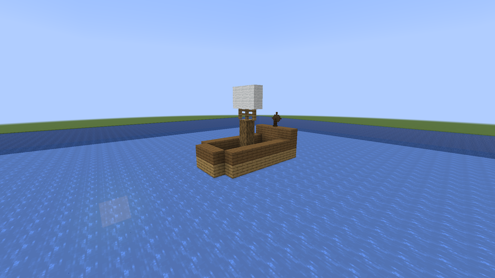
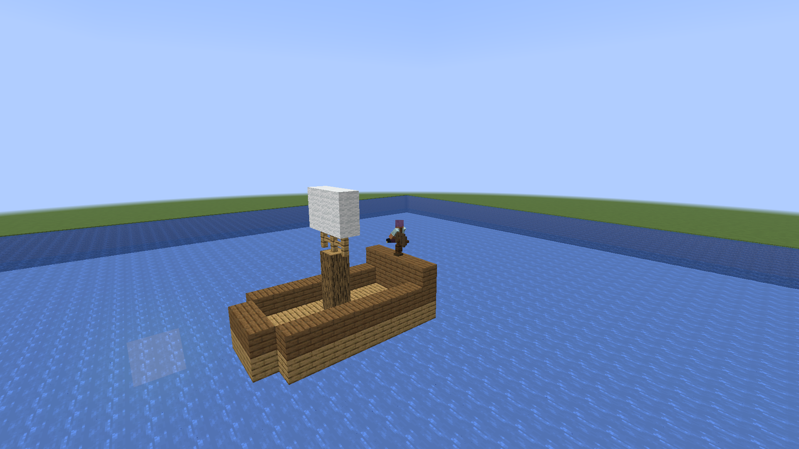

# Big Boats

A Minecraft Fabric mod that lets you build and sail multi-block ships. Build any structure, add a helm, christen it, and sail away.

## Screenshots




## Features

### Ship Building
- **Build any structure** using standard Minecraft blocks
- A plain helm holds a ship of up to **100 blocks**; the **Tonnage** enchantment on the helm raises that to 400, 1,000 and **2,000 blocks**
- Supports **block entities** (chests, furnaces, signs); contents persist
- **Item frames and paintings** travel with the ship and restore on dock
- **Doors, trapdoors, and fence gates** remain interactive while sailing
- **Cushions** stay aboard while sailing, and sitting on one is a way to ride as a passenger. Docked, each is back on the block it was placed on, whichever way the ship now faces
- With [chest-utils](https://github.com/fatlard1993/chest-utils) installed, a **painted chest** keeps its colour through a voyage

### The Helm
- Craft and place a **Helm block** as your ship's wheel
- The helm determines the ship's forward direction
- Right-click the helm to board your ship; right-click it again while piloting to stop and dock
- Enchant the helm with **Tonnage** to command a bigger ship

### Christening
- Craft a **Christening Bottle** to launch your ship
- Throw the bottle at any part of your ship structure
- Name the bottle in an anvil to name your ship

### Sailing
- **WASD controls**: W/S for forward/back thrust, A/D to rotate
- Ships have **momentum-based physics**; they accelerate and coast
- **Speed builds on open water**: a ship reaches harbour speed (about 3.6 blocks a second) in a second or so, handy for channels and docks, and keeps gathering speed while W stays held, to about 9 blocks a second after some sixteen seconds of clear water. Let go and it slows back to harbour speed in a couple of seconds. Reversing tops out at harbour speed
- A keel: a ship barely slides sideways, so at speed it turns where it points rather than drifting
- **Collision detection** stops ships at terrain and other ships (breaks through plants, coral and loose rock)
- Ships **snap to grid** when you dismount for clean docking
- Anyone standing on the deck is carried along, through the snap to the grid included. On a current Pandorical client you walk the deck you see: your client holds you on it and moves you with it
- **Coral and loose rock give way**: coral, coral fans and sea pickles are knocked aside like kelp, and natural terrain (coral block, stone, dirt, sand, gravel, clay, sandstone, magma) held on by no more than two faces breaks when the hull hits it, so reefs and shallows can be threaded. Anything more firmly set, or built rather than grown, stops the ship
- A ship holds the height it was christened at

### Docking System
- Ships **auto-dock** when you dismount (places real blocks back)
- Ships **auto-undock** when you board (converts to a rendered Pandorical structure)
- **Block absorption**: Small structures touching your ship may be absorbed when undocking
- **Grounding detection**: Can't sail if connected to a large landmass. Touching means the shapes meet: a slab beside a slab of the other half, or a block a step above a bottom slab, is not a connection
- **Occupied check**: Only one pilot at a time
- **Structure damage detection**: Can't undock if the ship structure is broken

## Learning It

The helm turns up in your recipe book as soon as you are holding planks, a stick or an iron ingot, which is the one hint the game gives you on its own. Nothing else points at ships: no ore to find, no structure to stumble on, and no way to guess that a helm turns the hull around it into a boat.

So with [village-quests](https://github.com/fatlard1993/village-quests) installed, a fisherman who trusts you (50 reputation) will sell you the makings: 32 planks, a helm and a christening bottle for 24 emeralds, and the two recipes to go with them.

This is a shop rather than a quest, because nothing here needs doing. The kit is deliberately not a ship: enough to make the idea concrete, nowhere near enough to skip the building.

Optional and guarded: without village-quests the mod behaves exactly as before.

## Items

### Christening Bottle
Thrown item that converts a block structure into a sailable ship entity.

**Recipe** (shapeless):
- 1x Glass Bottle

A christening that fails drops the bottle back with the reason.

### Helm Block
The ship's wheel, required for every ship. Place it facing the direction you want to sail.

**Recipe:**
```
    [S]
[S][I][S]
[P][P][P]
```
S = Stick, I = Iron Ingot, P = Any Planks

### Tonnage
An enchantment for the helm, from the enchanting table, books, loot and trades. It sets how large a ship the helm can hold together, including blocks absorbed later:

| Helm | Ship size |
|------|-----------|
| Plain | 100 blocks |
| Tonnage I | 400 blocks |
| Tonnage II | 1,000 blocks |
| Tonnage III | 2,000 blocks |

The rating is kept when the helm is placed, and a broken helm drops with its Tonnage. A bottle thrown at a ship too big for its helm is refused, with a message saying so.

## Controls

| Key | Action |
|-----|--------|
| W | Accelerate forward |
| S | Accelerate backward |
| A | Rotate left |
| D | Rotate right |
| Shift | Dismount (docks the ship) |

## Technical Details

- **Minimum ship size**: 2 blocks (helm + at least one other)
- **Maximum ship size**: 100 blocks on a plain helm, 2,000 at Tonnage III
- **Ship lighting**: Light-emitting blocks on ships place invisible light blocks that move with the ship
- Collision checks all block corners to prevent clipping
- Hull-only collision optimization skips interior blocks
- Crash recovery: ships sailing when the server stops are force-docked on restart with all blocks restored. A ship whose undock was interrupted part-way resolves to whichever side of that it had reached, rather than being saved mid-transition

## Pandorical

Big Boats runs server-side, and [Pandorical](https://github.com/fatlard1993/pandorical) is required: the server will not load this mod without it. Three things route through it:

- **Ship rendering**: a ship's blocks are drawn as a single batch-rendered Pandorical structure, posed and moved each tick to follow the ship. The ship entity itself uses Pandorical's `"invisible"` renderer and draws nothing; only the structure is visible.
- **Walking the deck**: the ship's structure is marked walkable, so a Pandorical client stands its player on the deck it draws and carries them with it. Those players are left to their client: the server does not push them along, and the invisible collision it keeps for everything else is neither sent to them nor solid to them. This needs Pandorical 15 or newer on the client; there is no handshake and no fallback, so an older client sees no ship at all.
- **Piloting camera**: pull-back distance and third-person-back perspective are pushed to the player through Pandorical's camera API on mount and dismount. A passenger sitting on a cushion gets a shorter pull-back than the pilot.

Clients are not the optional half here. A ship is invisible without Pandorical, so a vanilla client cannot see or pilot one at all.

## Commands

| Command | Permission | Description |
|---------|-----------|-------------|
| `/bigboats cleanup-lights` | GAMEMASTERS | Removes orphaned light blocks within 50 blocks of you. Active ships re-place theirs next tick. |
| `/ship-lock lock` | everyone | Locks the ship you are on, or nearest to, so only you and your crew can sail it |
| `/ship-lock unlock` | everyone | Opens it to anyone again |
| `/ship-lock share <player>` | everyone | Lets someone else sail it |
| `/ship-lock unshare <player>` | everyone | Takes that back |
| `/ship-lock list` | everyone | Who owns it, whether it is locked, and who is aboard the crew |

## Known Limitations

- Ladders don't function for climbing while sailing
- Single driver only
- No ship ownership model (any player can mount any ship)

## Development

Installing, building and where to report problems are in [DEVELOPMENT.md](DEVELOPMENT.md).

## License

MIT, see [LICENSE](LICENSE).
